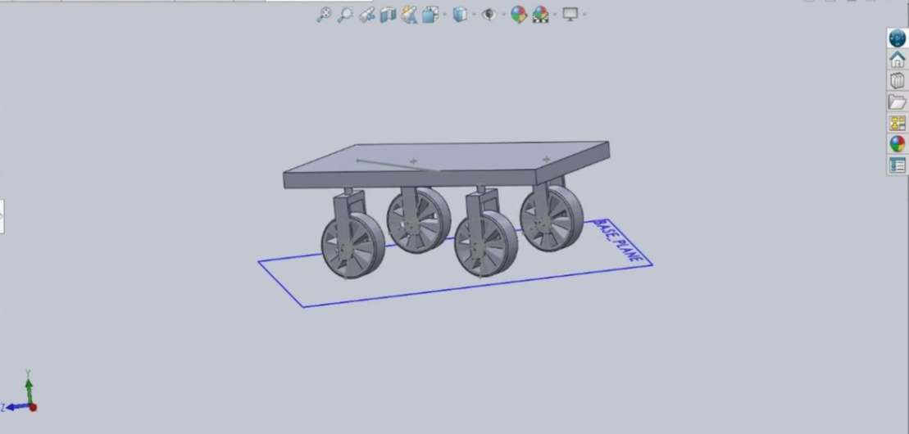

# Toy Car Robot 

This README provides instructions on how to set up and run the different components of the Toy Car Robot project. This includes visualizations with Rviz, simulations with Gazebo, debugging tools, and running the car in a competition map.

|Team Members
|--
|Saketh Narayan Banagiri
|Aashrita Chemakura

## Solidworks Design

<p align="center">

</p>

## Installation

To use the Assem3_6 package, follow these steps to set up your ROS environment:

1. Clone this repository into your Catkin workspace:

```bash
cd ~/catkin_ws/src
git clone https://github.com/aashrita-chemakura/Assem3_6.git
```
2. Build the package using catkin:
```bash
cd ~/catkin_ws
catkin_make
```
3. Ensure all dependencies are installed:
```bash
rosdep install --from-paths src --ignore-src -r -y
```
## Usage 

### Teleoperation
To teleoperate the robot, use the following commands:

1. Launch the robot environment:
```bash
roslaunch Assem3_6 template_launch.launch
```
2. In a new terminal, run the teleoperation script:
```bash
rosrun Assem3_6 teleop_template.py
```
### Publisher and Subscriber
To run the publisher and subscriber nodes:

1. Launch the robot environment if not already running:
```bash
roslaunch Assem3_6 template_launch.launch
```
2. In a new terminal, start the publisher:
```bash
rosrun Assem3_6 publisher.py
```
3. In another terminal, start the subscriber:
```bash
rosrun Assem3_6 subscriber.py
```
### Laser Scan Visualization in Rviz
To visualize laser scans with Rviz:

1. Launch the robot environment if not already running:
   ```bash
   roslaunch Assem3_6 template_launch.launch
   ```
2. Open Rviz in a new terminal:
```bash
rviz
```
3. Add the robot model and Laser Scan topic in Rviz to visualize the obstacles detected in the simulated environment.
